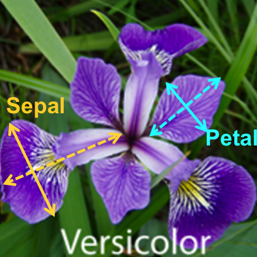

<style type="text/css">
.title {
  display: none;
}

.table {
    width:70%;
}

#getting-started img {
  margin-right: 10px;
}

</style>


# Analiza wariancji - manova


Do tej pory rozważaliśmy sytuację, kiedy zmienna zależna była jedna, a zmiennych niezależnych było kilka. 

Odwróćmy sytuację. Mamy kilka zmiennych zależnych i jedną zmienną niezależną.

Załadujmy dane:

```{r}
dane<-iris
head(iris)
```

Spójrzmy na rysunek:



<sub><sup>https://melindahiggins2000.github.io/N741UnsupervisedLearning/UnsupervisedLearning.html</sup></sub>

```{r}
sepl <- iris$Sepal.Length
petl <- iris$Petal.Length
model <- manova(cbind(Sepal.Length, Petal.Length) ~ Species, data = iris)
summary(model)
```

Hipoteza zerowa: średnie w poszczególnych grupach są równe.
Hipoteza alternatywna: co najmniej jedna średnia jest inna od pozostałych.

</div>

