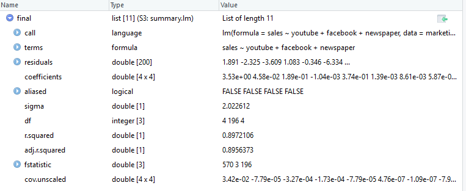

<style type="text/css">
.title {
  display: none;
}

.table {
    width:70%;
}

#getting-started img {
  margin-right: 10px;
}

</style>


# Model liniowy


Rozważamy wpływ zbioru $k$ zmiennych $X_1, \ldots, X_k$ na zmienną $Y$. Należy wprowadzić do modelu jak największą liczbę zmiennych niezależnych oraz powinny się w nim znaleźć zmienne silnie skorelowane ze zmienną zależną i jednocześnie jak najsłabiej skorelowane między sobą.


Liniowy model regresji wielowymiarowej:

$$Y=\beta_0 +\beta_1\cdot X_1+\beta_2\cdot X_2+\ldots+\beta_k\cdot X_k+\varepsilon.$$
 $\beta_i$ - współczynniki regresji (parametry modelu) opisujące wpływ $i$-tej zmiennej. $\varepsilon$ - składnik losowy.
 


Załadujmy pakiety i pewną ramkę danych:

```{r message=FALSE}
library(tidyverse)
devtools::install_github("kassambara/datarium")
data("marketing", package = "datarium")
```

```{r}
head(marketing)
```

Ramka `marketing` opisuje wydatki na reklamę w poszczególnych mediach oraz zyski ze sprzedaży. Naszym celem zbadanie wpływu wydatków na wyniki sprzedaży.

Sprawdźmy co otrzymamy w R:
```{r}
model <- lm(sales ~ youtube + facebook + newspaper, data = marketing)
final<-summary(model)
final
```

Widok w RStudio:


Strona w dokumentacji o funkcji `lm` - [link](https://www.rdocumentation.org/packages/stats/versions/3.5.2/topics/lm).



Sprawdźmy typ:
```{r}
class(model)
class(final)
```

## Współczynniki w modelu

Zapiszmy nasz model w postaci:

$$ y = X\beta + \varepsilon,$$
gdzie:
$$y = \begin{bmatrix}
y_1 \\ y_2 \\ \vdots \\ y_n
\end{bmatrix}, \quad  {X}=\begin{bmatrix}
X_{10} & X_{11} & X_{12} & \cdots & X_{1p} \\
X_{20} & X_{21} & X_{22} & \cdots & X_{2p} \\
\vdots & \vdots & \vdots & \ddots & \vdots \\
X_{n0} &X_{n1} & X_{n2} & \cdots & X_{np}
\end{bmatrix} ,
\quad  \beta = \begin{bmatrix}
\beta_0 \\ \beta_1 \\ \vdots \\ \beta_p \end{bmatrix}, \quad \varepsilon = \begin{bmatrix}
\varepsilon_1 \\ \varepsilon_2 \\ \vdots \\ \varepsilon_n
\end{bmatrix}$$

Na mocy konwencji $x_{i0} = 1$ dla wszystkich $i = 1, \ldots, n$. Wtedy $\beta_0$ jest wyrazem wolnym.
Możemy też zapisać następująco:
$$y_i = \beta_0 +X_{i1}\beta_1+X_{i2}\beta_2+\ldots+X_{ip}\beta_p+\varepsilon_i, \quad i=1,\ldots, n.$$

Zazwyczaj taki układ równań nie ma rozwiązania. Naszym zadaniem jest znalezienie możliwych wektorów $\beta$, które "dają najlepsze dopasowanie". Innymi słowy, musimy "matematycznie" rozwiązać problem znalezienia
$$\hat{\beta}=\underset{\beta}{\operatorname{arg\,min}}\,S(\beta), $$
$$S(\beta) = \sum_{i=1}^n \bigl| y_i - \sum_{j=0}^p X_{ij}\beta_j\bigr|^2 = \bigl\| y -  X  \beta \bigr\|^2.$$
Rozwiązaniem jest:
$$\hat{\beta}= ( X^T X )^{-1}  X^T  y.$$

Dowód: [wiki](https://en.wikipedia.org/wiki/Ordinary_least_squares) lub dowolny "dobry" podręcznik do zaawansowanej analizy matematycznej lub/i statystyki.

Jak to policzyć dla ramki `marketing`?

```{r}
x<-cbind(rep(1,200),as.matrix(marketing[,c(1,2,3)]))
y<-as.matrix(marketing[,c(4)])
betah = solve(t(x) %*% x) %*% (t(x) %*% y)
betah
model$coefficients
summary(model)$coefficients[,1]
coef(model)
betah-model$coefficients
```

## Odchylenie standardowe regresji

Dopasowane wartości (przewidywane wartości) - wartości otrzymane poprzez model:
$$\hat{y}=X\hat{\beta}=Py, \quad P=X(X^TX)^{-1}X^T.$$
Zróbmy to w R:
```{r}
yh<-x %*% betah
p<-x %*%  solve(t(x) %*% x) %*% t(x)
yh2<- p %*% y
yh3<-model$fitted.values
head(cbind(yh,yh2,yh3))
```

Zauważmy, że $PX=X$ oraz $PX-X=0$. Niech $M=I_n-P$. Wtedy $MX=0$. Macierz $M$ nazywamy macierzą anihilującą.

W R mamy:
```{r}
head(p %*% x)
head(x)
m<-diag(200)-p
head(m %*% x)
```

Teraz możemy obliczyć reszty (residua):

$$ \hat{\varepsilon} = y - \hat{y} = y - X\hat{\beta} = My = M(X\beta+\varepsilon) = (MX)\beta + M\varepsilon = M\varepsilon.$$
W R wygląda to następująco:

```{r}
eh<-y-yh
head(eh)
quantile(eh)
quantile(model$residuals)
quantile(summary(model)$residuals)
```

Dzięki resztom możemy estymować wariancję:

$$s^2 = \frac{\hat{\varepsilon} ^T \hat{\varepsilon}}{n-p} = \frac{(My)^T My}{n-p} = \frac{y^T M^TMy}{n-p}= \frac{y ^T My}{n-p} = \frac{S(\hat{\beta})}{n-p},\quad
    \hat\sigma^2 = \frac{n-p}{n}\;s^2$$
U nas $n=200$ i $p=4$ (liczba zmiennych plus 1 zgodnie z konwencją). Liczba $n-p$ odpowiada "w ujęciu statystycznym" liczbie stopni swobody.

W R mamy:
```{r}
s2<- t(eh) %*% eh /196
s2<-as.numeric(s2)
sqrt(s2)
sigmah2<-196/200*s2
sqrt(sigmah2)
```

*$s^2$ jest nieobciążonym estymatorem wariancji przy użyciu metody najmniejszych kwadratów. $\hat{\sigma}^2$ jest obciążonym estymatorem wariancji przy użyciu metody najmniejszej wiarygodności. Częściej jest używane $s^2$.*

```{r}
summary(model)$sigma
```
$s^2$  nazywa się odchyleniem standardowym składnika resztowego, błędem standardowym regresji, odchyleniem standardowym regresji...

## "Dobroć" dopasowania

Współczynnik determinacji:

$$ R^2 = \frac{\sum(\hat{y}_i-\overline{y})^2}{\sum(y_i-\overline{y})^2} = \frac{y ^T P ^T LPy}{y ^T Ly} = 1 - \frac{y^T My}{y^T Ly} = 1 - \frac{ SSR}{SST} = \frac{SSM}{SST},$$
gdzie $L=I_n - \mathbf{1}\mathbf{1}^T/n$, a $\mathbf{1}$ to macierz wymiaru $n\times 1$ składająca się z samych jedynek. $SST$ - całkowita (totalna) suma kwadratów, $SSR$ - suma kwadratów reszt (błędów), $SSM$ - skorygowana suma kwadratów dla modelu.

W R mamy:
```{r}
ym=mean(y)
ssm<-sum((yh-ym)^2)
sst<-sum((y-ym)^2)
r2<-ssm/sst
r2
one<-matrix( rep( 1, len=200), nrow = 200)
l<-diag(200)- one %*% t(one) /200
t(y) %*% t(p) %*% l %*% p %*% y / (t(y) %*% l %*% y)
1- t(y) %*% m %*% y /(t(y) %*% l %*% y)
summary(model)$r.squared
```

Skorygowany współczynnik determinacji:

$$\overline{R}^2=1 - (1 - R^2) \frac{n - 1}{n - p}$$
W R mamy:
```{r}
ro2<-1-((1-r2)*(199/196))
ro2
summary(model)$adj.r.squared
```

## F-test

Powtórzmy i wprowadźmy nowe oznaczenia:

* $n$ - liczba obserwacji
* $p$ - liczba parametrów regresji (w modelu liniowym to liczba zmiennych objaśniających+1 zgodnie z konwencją)
* $SSM$ - skorygowana suma kwadratów modelu
$$SSM=\sum_{i=1}^n ( \hat{y}_i-\overline{y} )^2$$
```{r}
ssm<-sum((yh-ym)^2)
ssm
```
* $SSR \ (SSE)$ - suma kwadratów reszt, błędów

$$SSR=\sum_{i=1}^n ( y_i-\hat{y}_i )^2$$
```{r}
ssr<-sum((y-yh)^2)
ssr
```

* $SST$ - skorygowana totalna (całkowita) suma kwadratów

$$ SST = \sum_{i=1}^n ( y_i-\overline{y} )^2$$

```{r}
sst<-sum((y-ym)^2)
sst
```

Zachodzi równość:
$$SSM+SSR=SST$$
```{r}
ssm+ssr
```

* $DFM$ - skorygowane stopnie swobody modelu (u nas w modelu liniowym liczba zmiennych objaśniających), $DFM=p-1$
* $DFE$ - stopnie swobody błędu, $DFE=n-p$
* $DFT$ - skorygowane totalne (całkowite) stopnie swobody, $DFT=n-1$

Zachodzi:
$$DFM + DFE = DFT.$$

* $MSM$ - średnia kwadratów modelu, $MSM = SSM / DFM$

```{r}
msm<-ssm/3
msm
```

* $MSE$ - średnia kwadratów błędów, $MSE = SSR / DFE$

```{r}
mse<-ssr/196
mse
```

* $MST$ - totalna (całkowita) średnia kwadratów, $MST = SST / DFT$

```{r}
mst<-sst/199
mst
```

**F-test dla regresji wielowymiarowej**

$$H_0: \qquad   \beta_1 = \beta_2 = \ldots = \beta_{p-1} = 0$$
 
$$H_1: \qquad  \beta_j \neq 0 \ \mathrm{dla \ co \ najmniej \ jednego} \ j.$$
Wyliczamy statystykę:

$$F=\frac{MSM}{MSE} = \frac{\mathrm{"wyjaśniona \ wariancja"}}{\mathrm{"niewyjaśniona \ wariancja"}} $$
```{r}
f<-msm/mse
f
summary(model)$fstatistic
```

Statystyka ta podlega rozkładowi F-Snedecora z $p-1$ i $n-p$ stopniami swobody. Ustalamy $\alpha=0,05$.

```{r}
qf(0.95, 3, 196)
```

Jeśli wartość statystyki jest większa kwantylowi, odrzucamy hipotezę zerową. W przeciwnym wypadku przyjmujemy hipotezę zerową.

W naszym wypadku odrzucamy hipotezę zerową. Innymi słowy, odrzucamy hipotezę że wydatki na reklamy na poszczególne media nie mają wpływu na sprzedaż.

Obliczmy wartość $p$:
```{r}
p<-1-pf(f, 3,196)
p
fstat<-summary(model)$fstatistic 
1-pf(fstat[1], fstat[2],fstat[3])
```
W naszym wypadku jest to "bliskie" zeru, więc możemy przyjąć, że się zgadza.

Jeśli $p\leqslant \alpha$ odrzucamy $H_0$ przyjmując $H_1$. W przeciwnym wypadku nie ma podstaw by odrzucić $H_0$.

## t-test

Przypomnijmy, że
$$\hat{\beta}= ( X^T X )^{-1}  X^T  y.$$

Wariancja wektora współczynników:
$$\operatorname(VAR) (\hat{\beta}) = \sigma^2 (X^TX)^{-1}.$$
Zamieniając na estymator nieobciążony:
$$\widehat{\operatorname(VAR)}(\hat{\beta}) = s^2 (X^TX)^{-1} $$
By otrzymać odchylenie standardowe poszczególnych współczynników, wybieramy elementy na głównej przekątnej ostatniej macierzy i potem je pierwiastkujemy.

```{r}
v<-s2 * solve(t(x) %*% x)
v
vcov(model)
varbeta<-sqrt(diag(v))
sqrt(diag(vcov(model)))
summary(model)$coefficients[,2]
```

Statystykę $t$ określamy następująco:
$$t=\frac{\hat{\beta}}{\widehat{\operatorname(VAR)}(\hat{\beta})}$$
```{r}
tstat<-betah/varbeta
tstat
summary(model)$coefficients[,3]
```

Na koniec liczymy odpowiednie prawdopodobieństwo (liczba stopni swobody to $n-p$):

```{r}
2 * pt(abs(tstat), 196, lower.tail = FALSE)
summary(model)$coefficients[,4]
```

Test $t$ pozwala zweryfikować istotność oszacowania parametru dla każdej ze zmiennej objaśniającej.
$$H_0: \qquad \beta_i=0$$
$$H_1: \qquad \beta_i\neq 0$$

Jeśli prawdopodobieństwo jest mniejsze niż poziom ufności (domyślnie $\alpha=0,05$) to odrzucamy $H_0$ na rzecz $H_1$ (odpowiednia zmienna objaśniająca ma wpływ na zmienną objaśnianą). W przeciwnym wypadku nie mamy podstaw do odrzucenia $H_0$ (brak wpływu).

W rozważanym przykładzie jedynie w przypadku zmiennej `newspaper` przyjmujemy $H_0$.
Nie jest zatem znacząca w modelu regresji wielokrotnej. Oznacza to, że w przypadku ustalonej kwoty budżetu reklamowego `youtube` i `facebook` zmiany w budżecie reklamowym newspaper nie wpłyną znacząco na wyniki sprzedaży. Możemy zatem zmienną `newspaper` usunąć z modelu:

```{r}
model2  <- lm(sales ~ youtube + facebook, data = marketing)
summary(model2)
```

# Inne zapisy

W R możemy wywołać modele nieco inną składnią:

```{r}
model3 <- lm(sales ~., data = marketing)
summary(model3)
model4 <- lm(sales ~. -newspaper, data = marketing)
summary(model4)
model5 <- lm(marketing$sales~ marketing$youtube + marketing$facebook)
summary(model5)
```

# Założenia modelu

* **Istnienie**: Dla każdej kombinacji wartości zmiennych objaśniających
$X_1, X_2,\ldots, X_k$, zmienna objaśniana $Y$ jest (jednoznaczną) zmienną losową z określonym rozkładem prawdopodobieństwa posiadającym skończoną wartość oczekiwaną i wariancję.

* **Kontrolowanie wartości czynników**: Zmienną losową jest zmienna $Y$, podczas gdy zmienne $X_1, X_2,\ldots, X_k$ są zmiennymi (nielosowymi) kontrolowanymi.


* **Liniowość**: zmienna $Y$ jest liniową kombinacją zmiennych $X_1, X_2,\ldots, X_k$.

* **Niezależność**: Obserwacje zmiennej objaśnianej $Y$ są od siebie niezależne, tzn. poszczególne obserwacje zmiennej $Y$ nie zależą od wartości otrzymanych wcześniej.

* **Stałość rozproszenia (homoscedastyczność)**: Wariancja (warunkowa) zmiennej $Y$ dla dowolnej
ustalonej kombinacji zmiennych $X_1, X_2,\ldots, X_k$ jest taka sama (jednorodna) dla wszystkich rozkładów
warunkowych

* **Normalność**: Dla dowolnej ustalonej liniowej kombinacji zmiennych $X_1, X_2,\ldots, X_k$, zmienna $Y$ ma
rozkład normalny

# Na koniec


<sub><sup>https://sadlaff.files.wordpress.com/2014/02/sad-laff-working-from-home-joke1-e1392532216836.jpg</sup></sub>


<sub><sup>https://imgs.xkcd.com/comics/sustainable.png</sup></sub>


<sub><sup>https://statsland.files.wordpress.com/2012/08/extrapolating.jpg</sup></sub>
</div>

