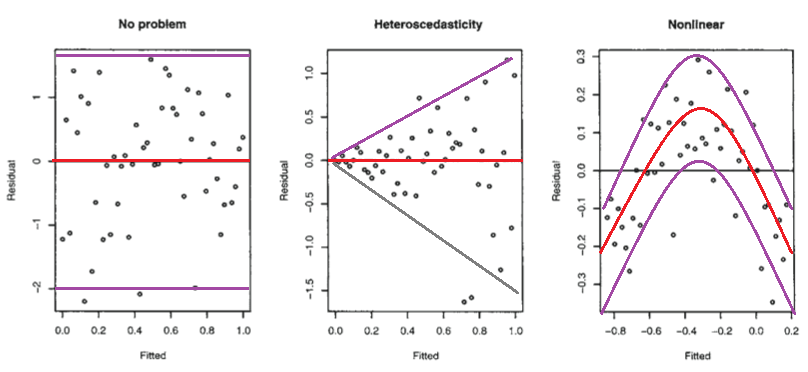

<style type="text/css">
.title {
  display: none;
}

.table {
    width:70%;
}

#getting-started img {
  margin-right: 10px;
}

</style>


# Model liniowy - grafika


Załadujmy w R jak poprzednio:

```{r message=FALSE}
library(tidyverse)
devtools::install_github("kassambara/datarium")
data("marketing", package = "datarium")
model <- lm(sales ~ youtube + facebook + newspaper, data = marketing)
```
```{r}

plot(model)
```

## Wykres 1

Przeanalizujmy pierwszy wykres:

```{r}
plot(model, which = 1)
```

Ręcznie możemy to uzyskać:
```{r}
plot(model$fitted.values, model$residuals,  ylab = "Residuals", xlab = "Fitted values", )
lines(lowess(model$fitted.values, model$residuals), col='red', lwd=2)
```

Wyjaśnienie na rysunku:



<sub><sup>źródło zdjęcia: https://stats.stackexchange.com/questions/76226/interpreting-the-residuals-vs-fitted-values-plot-for-verifying-the-assumptions</sub>

## Wykres 2

```{r}
plot(model, which = 2)
```

Wykres Q-Q (kwantylowo-kwantylowy) informuje, na ile dopasowanie odbiega od rozkładu normalnego.

## Wykres 3

```{r}
plot(model, which = 3)
```

Ten wykres pokazuje, czy reszty są równomiernie rozłożone wzdłuż zakresów dopasowanych wartości. W ten sposób można sprawdzić założenie równej wariancji (homoscedastyczność). To dobrze, jeśli jest linia pozioma z równomiernie umieszczonymi punktami.

## Wykres 5

```{r}
plot(model, which = 5)
```

Wykres pokazuje jednorodność wariancji. Cel: linia ciągła jest pozioma, punkty równomiernie rozłożone, brak linii przerywanej. Dokładniejsze wytłumaczenie: [link](http://prac.im.pwr.wroc.pl/~sobczyk/dydaktyka/diagnostyka_regresji.pdf).

# Ćwiczenia

1. Wygeneruj w R idealny rozkład zgodny z liniową regresją wielokrotną np. za pomocą kod:

```{r}
n <- 1000      
x1 <- runif(n, min = 0, max = 100)
x2 <- runif(n, min = 0, max = 100)
y.good <- 5 + 0.2 * x1+14*x2 + rnorm(n, sd = 3)
```

Przetestuj model i przeanalizuj wykresy.

2. Przetestuj błędny model np.
```{r}
y.bad<-5+sin(x1)+x2*x2+rnorm(n,sd=4)
```

3. Przeanalizuj wykresy dla ramek danych ze wcześniejszych ćwiczeń.
</div>

